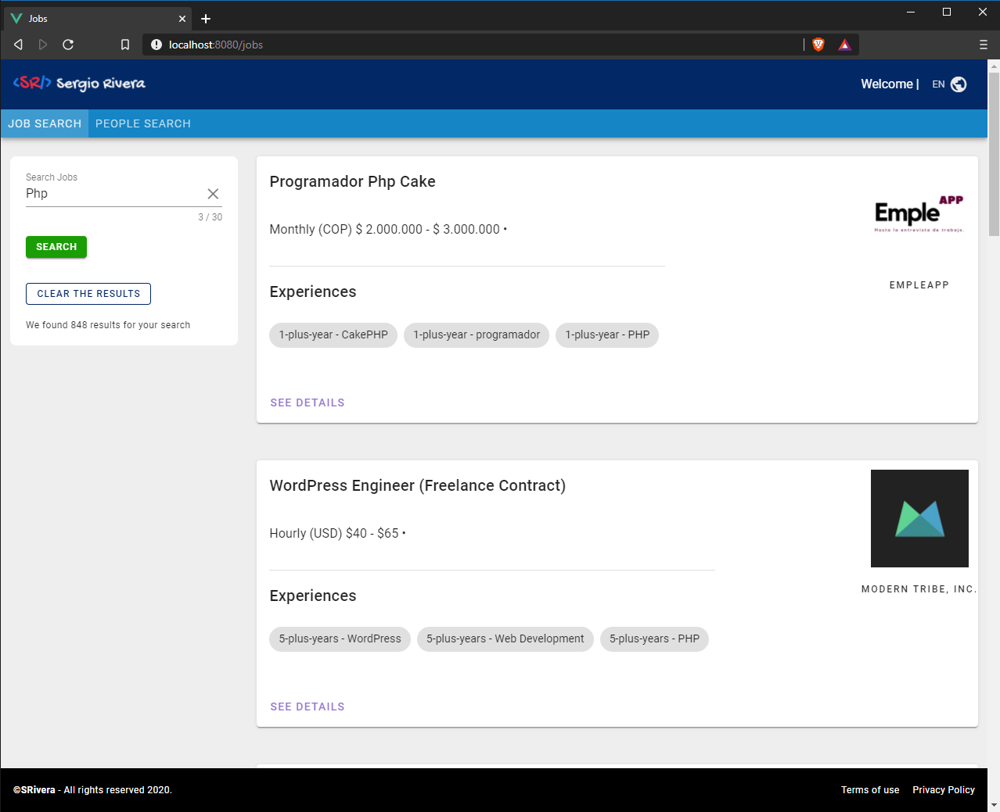
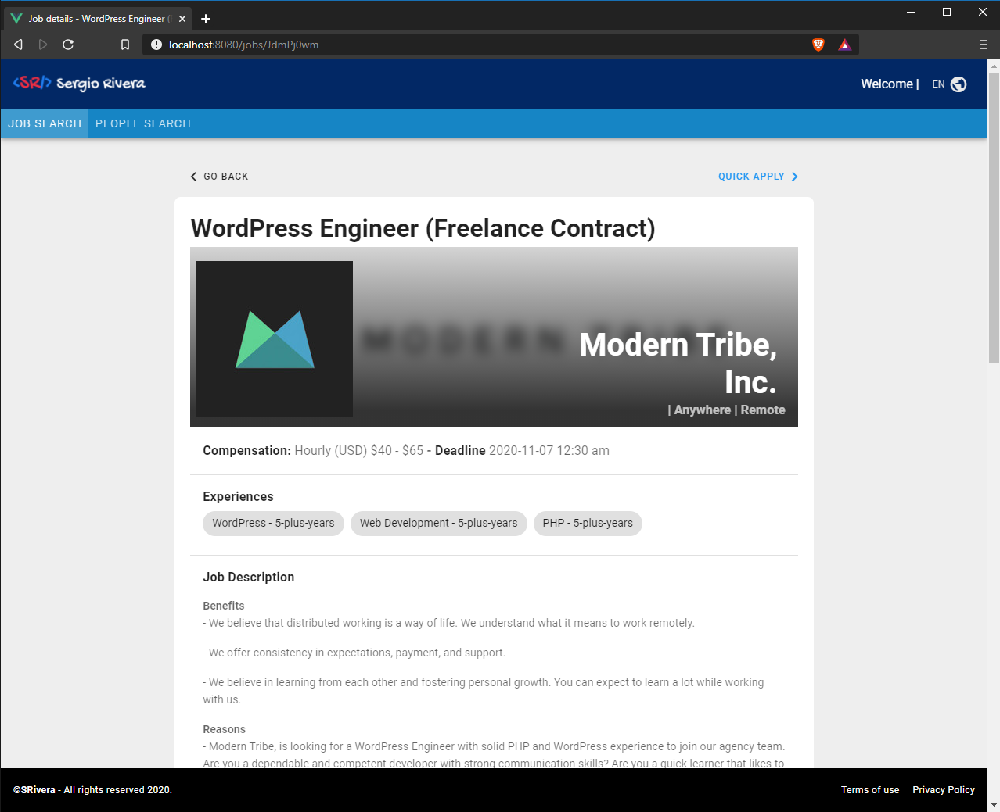
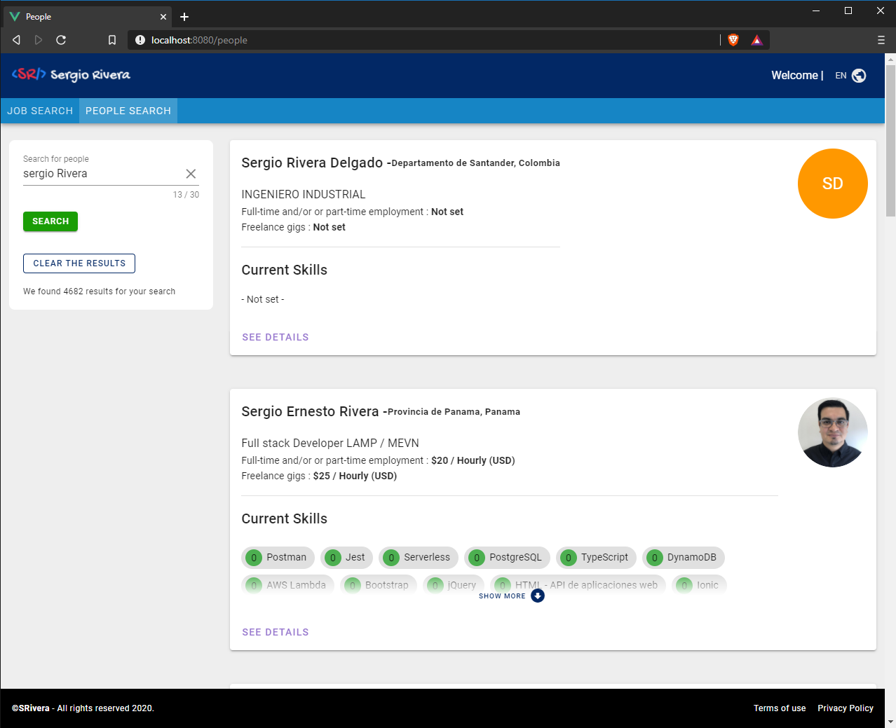
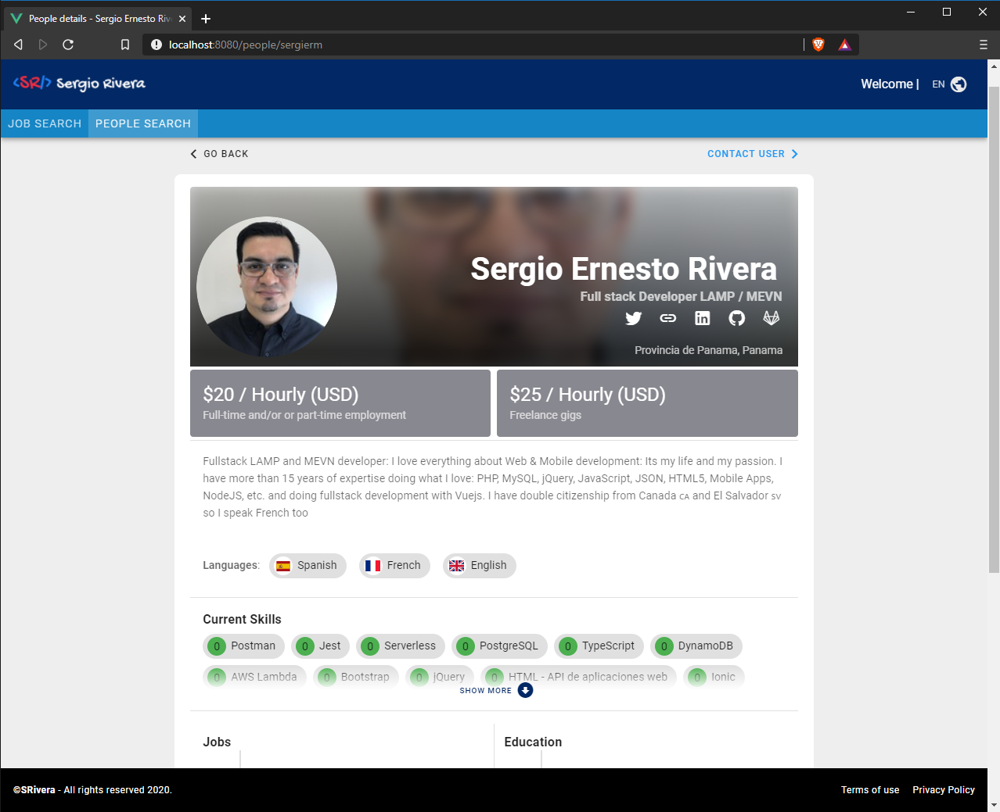

# vue-job-searching
Will search for Jobs or people (users)

Made by Sergio Rivera with Vue, Vuex, Vuetify, Typescript and vue-i18n for french, spanish and english translation:

Preview at https://sergiorivera.me/vue-search-jobs/ 

I had some CORS errors while trying to get Username details so I am getting throught a PHP page.

I am using https://www.npmjs.com/package/vue-types by the way to simplify access to Vuex store from components

Thanks

Sergio Rivera

Full Stack developer

sergi.erm@gmail.com 

https://www.linkedin.com/in/sergio-rivera-morales/

https://bio.torre.co/en/sergierm 

## Project setup
```
npm install
```

### Compiles and hot-reloads for development
```
npm run serve
```
## Screenshots:

- https://sergiorivera.me/vue-search-jobs
  
  
- https://sergiorivera.me/vue-search-jobs/jobs/JdmPj0wm
  
  

- https://sergiorivera.me/vue-search-jobs/people
  
  
- https://sergiorivera.me/vue-search-jobs/people/sergierm
  
 


### Nice to have

- Full Models or Interfaces: Since its a demo I did not create all the models or interface for full typed code
- Show all the data from details: There is a lot of information mostly at User Details that I did not include is this short time
- Unit test: I am not including any Unit Test, I do JEST but I gotta say that I am not an "experto" doing them with Vue components **BUT** with due time and experience I can learn to implement them quickly.
